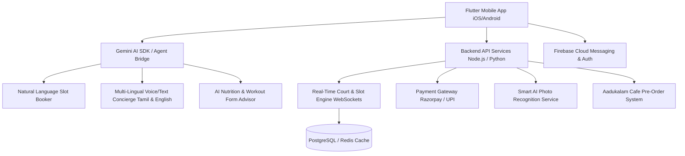

# Next-Gen Mobile App Implementation Plan for DUSA Sports Academy

DUSA Sports Academy is transitioning from a traditional static web enquiry system to an advanced, AI-powered Flutter mobile app for iOS and Android. This plan outlines the technical architecture, advanced feature breakdown, Gemini AI integrations, automated slot booking engine, and phased implementation roadmap.

## User Review Required

> [!IMPORTANT]
> **Gemini AI Integration**: Gemini 1.5/2.0 API will be integrated for natural language booking ("Book Court 2 tomorrow 6 PM"), multi-lingual AI concierge (Tamil + English), and personalized workout/nutrition plans.
> **Automated Booking Engine**: Upgrading from static modal forms to real-time socket-driven court/slot reservations with instant UPI/Razorpay payment confirmation.

## Architectural Overview

---

## 🚀 Advanced Next-Gen Feature Breakdown

### 1. 🤖 Gemini AI Core Integrations
* **Voice & Text AI Concierge ("DUSA AI")**: Speaks & understands **English & Tamil**. Answers queries regarding facility timings, membership plans, trainer availability, and recovery guidelines.
* **Natural Language Auto-Booking**: Users type or say *"Book badminton court tomorrow at 7 PM for 2 players"*. Gemini parses intent, checks real-time database availability, presents a 1-tap confirmation card, and handles reservation.
* **AI Smart Nutrition Assistant**: Analyzes user's workout intensity (e.g., 1 hour intense badminton session) and recommends custom pre/post workout meals from **Aadukalam Café** menu.
* **AI Workout & Badminton Form Feedback**: Members upload a short clip or photo of their stance/stroke -> Gemini Vision analyzes posture and gives performance enhancement tips.

---

### 2. ⚡ Real-Time Automated Booking Engine (Upgraded from Enquiry Forms)
* **Visual Interactive Court Selector**: 2D/3D map of the 4 wooden badminton courts showing real-time occupied/available slots with color-coded heatmaps.
* **Multi-Facility Booking Hub**:
  * **Badminton**: Hourly court rentals, coaching batch slot reservation.
  * **Swimming**: Slot capacity tracker (prevents overcrowding) & seasonal batch registration.
  * **Recovery Zone**: Book steam, sauna, or muscle recovery sessions.
  * **Gym & Personal Trainers**: Reserve personal trainer slots & specialized equipment classes.
* **Instant Payments**: Integration with UPI, GPay, PhonePe, Cards, and DUSA Wallet credits.
* **Smart Waiting List & Slot Swapping**: Auto-notifies users if a booked court gets canceled.

---

### 3. 👥 "DUSA Play" Matchmaking & Community
* **Find Playing Partners**: Connects members looking for Badminton or Pickleball opponents based on skill rating (Beginner, Intermediate, Advanced).
* **Tournament Hub & Live Scores**: Register for academy tournaments, view live brackets, and track match schedules.
* **Smart Photo Finder Integration**: In-app selfie capture powered by face recognition to instantly match, display, and download high-res tournament action photos.

---

### 4. 🥤 Aadukalam Café Pre-Ordering Engine
* **Order While You Play**: Schedule a high-protein shake or healthy meal to be ready right when your 1-hour workout finishes.
* **Dietary Tagging**: High-protein, low-carb, hydration smoothies, post-workout recovery meals.

---

### 5. 💳 Smart Membership, QR Access & Gamification
* **Digital Membership Card & QR Check-In**: Instant QR code scan at the academy entry turnstile.
* **Women-Exclusive Slot Management**: Auto-enforces reserved access during exclusive women's hours (11:00 AM – 1:00 PM).
* **Streak & Activity Badges**: Gamified rewards (e.g., "10-Day Gym Streak", "Badminton Ace") redeemable for café discounts or recovery sessions.

---

## 🛠️ Proposed Tech Stack

| Component | Recommended Technology |
| :--- | :--- |
| **Frontend App** | **Flutter 3.x** (Dart) with BLoC / Riverpod state management |
| **AI Layer** | **Google Gemini API** (Gemini 1.5 Flash / Pro with Function Calling) |
| **Backend API** | **Node.js (TypeScript)** or **Python (FastAPI)** |
| **Real-Time Data** | **WebSockets** (Socket.io) + **Redis** for fast slot locks |
| **Database** | **PostgreSQL** (Prisma ORM) |
| **Media & Storage** | **Firebase Storage / AWS S3** (for photos, selfies, video clips) |
| **Payments** | **Razorpay SDK / UPI Deep Links** |
| **Push Alerts** | **Firebase Cloud Messaging (FCM)** |

---

## 📋 Phased Implementation Roadmap

### Phase 1: MVP Core Foundation
- Flutter project structure with modern Dark Mode design tokens, typography, and vibrant sports aesthetics.
- User Authentication (Phone OTP / Google Sign-In / Apple Sign-In).
- Facility exploration pages with rich media carousels.
- Automated Real-time Slot & Court Booking system with Razorpay UPI payment integration.

### Phase 2: Gemini AI & Smart Features Integration
- Integrate Gemini AI Chatbot with Function Calling (enabling text/voice auto-booking).
- In-app Smart AI Photo Finder (selfie upload & match gallery).
- Digital QR Code Member Card & Check-in system.

### Phase 3: Community, Café & Gamification
- Aadukalam Café in-app pre-ordering system.
- "DUSA Play" Player Matchmaking hub.
- Fitness streaks, activity tracking, and Push Notifications engine.

---

## Verification Plan

### Automated Tests
- Flutter unit tests for booking state management and slot collision prevention.
- Backend API tests for payment webhook validation and socket slot concurrency lock.
- Gemini Function Calling payload verification tests.

### Manual Verification
- Test natural language booking flow: prompt Gemini AI in Tamil and English to book a court slot.
- Test QR Code generation & check-in verification.
- Test real-time slot lock when two users select the same court concurrently.
